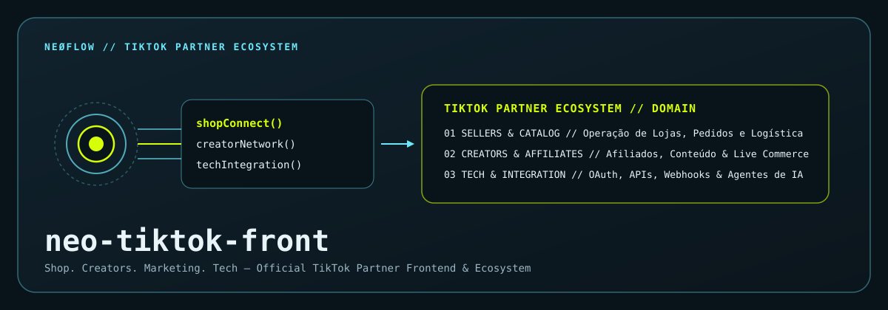
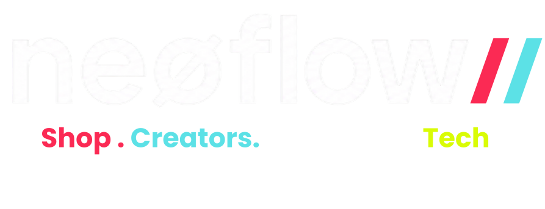
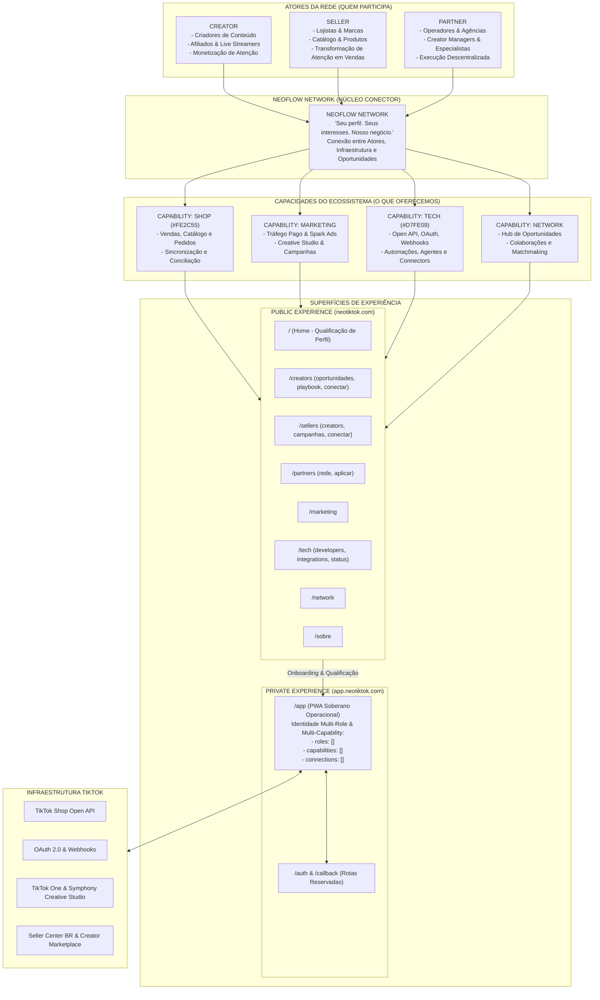

<!-- markdownlint-disable MD003 MD007 MD013 MD022 MD023 MD025 MD029 MD032 MD033 MD034 -->

# neøflow // Official TikTok Partners



```text
========================================
     neøflow · TIKTOK PARTNER FRONT
========================================
Status: ACTIVE
Version: v1.0.0
Framework: Astro 7 (TypeScript Strict)
Design System: Mobile-First iOS-Like
========================================
```



> **Seu perfil. Seus interesses. Nosso negócio.**
>
> não é programa de afiliados.
> não é prestação de serviços.
> não é marketing digital.
> *É apenas o que gostamos de fazer.*

────────────────────────────────────────

## ⟠ Objetivo Operacional

O repositório [neo-tiktok-front](file:///Users/nettomello/neomello/flowoff_tik_tok_partner/neo-tiktok-front/README.md) é o ponto focal de interface frontend e ecossistema de aplicação para a **neøflow // Official TikTok Partners**.

A Visão neøflow: "Marketing como Infraestrutura"
Enquanto o mercado legado de 2016 focava em campanhas publicitárias de lançamentos isolados e sazonais
, o social commerce de 2026 exige infraestrutura operacional contínua
.
A neøflow não atua como uma agência prestadora de serviços tradicional
. A tecnologia proprietária (microserviços, integração de catálogos via APIs, automação de direct messages, e funis de conversão de fricção zero) já foi totalmente construída nos bastidores
. Sob essa tese, a neøflow distribui a capacidade de sua infraestrutura pronta para que parceiros comerciais operem seus próprios territórios e consultorias de TSP, gerando receita recorrente e saudável sem centralizar o gargalo do suporte na equipe de engenharia principal
.
📊 Se quiser, nós podemos abrir a nossa calculadora integrada e projetar o faturamento de uma operação de TSP do Mês 1 ao Mês 10 para você visualizar o potencial de ganho com essa estrutura.

## Superfície canônica de App Review

- Product URL: `https://neotiktok.com`
- Reviewer login: `/login`
- Home autenticada: `/app`
- Orders: `/app/orders`
- Privacy: `/legal/privacidade`
- Terms: `/legal/termos`
- Official Creator Landing: `/creators/paulinha` (`https://neotiktok.com/creators/paulinha`)
- Production Host: **Railway** (`main` branch trigger)

A conta dedicada de reviewer existe, mas sua senha não pertence ao Git nem à
documentação. Search Orders pode retornar empty state validamente. Esta UI não
demonstra catálogo, Finance, Fulfillment, Creator ou LIVE.

O Partner Center mostra o `NEØ TikTok Shop Connector` como serviço público
`Ativados`, com upgrade bem-sucedido notificado em 03/09/2026 05:46, sem fuso
exibido. A referência auditável apresentada pelo portal é o Service ID
`7614526955808622356`; nenhum protocolo separado apareceu nas evidências.

A neøflow opera como uma infraestrutura descentralizada de comércio digital e agência de performance, integrando parceiros, criadores de conteúdo e lojistas diretamente às capacidades avançadas do TikTok Shop.

────────────────────────────────────────

## ⨷ Identidade & Marca

A doutrina visual é definida pela regra: **TikTok-native. neøflow-owned.**

```text
┏━━━━━━━━━━━━━━━━━━━━━━━━━━━━━━━━━━━━━━━━━━━━━━━━━━━━━━━━━━━━━━━━━━━━━━┓
┃ DOMÍNIO       PALETA CANÔNICA       CÓDIGO HEX       RESPONSABILIDADE┃
┣━━━━━━━━━━━━━━━━━━━━━━━━━━━━━━━━━━━━━━━━━━━━━━━━━━━━━━━━━━━━━━━━━━━━━━┫
┃ Tech / Infra  Acid Green            #D7FE09        Agentes & APIs  ┃
┃ Shop          Coral / Red           #FE2C55        Sellers & Vendas┃
┃ Creators      Cyan                  #00F2FE        Rede & Afiliados┃
┃ Marketing     White                 #FFFFFF        Campanhas & UGC ┃
┗━━━━━━━━━━━━━━━━━━━━━━━━━━━━━━━━━━━━━━━━━━━━━━━━━━━━━━━━━━━━━━━━━━━━━━┛
```

- **Fundo padrão:** Dark Canvas (`#09131A` / `#0B151C`).
- **Tipografia:** `Space Grotesk` (Títulos), `Inter` (Corpo), `IBM Plex Mono` (Dados/Labels).
- **Regra de Nomenclatura:** A marca escreve-se **sempre em minúsculas**: `neøflow` (nunca `NEØFLOW`).
- **Fronteira com TikTok:** Proibida qualquer reprodução ou clonagem de telas oficiais do Seller Center ou dashboards proprietários do TikTok. A marca neøflow deve passar no *Logo Removal Test* e *Screenshot Confusion Test*.

────────────────────────────────────────

## ⧉ Estrutura de Domínios

O ecossistema divide-se em 4 territórios fundamentais:

1. **01 — Shop (Sellers):** Gestão de catálogos, sincronização de inventário, pedidos, comissões e logística.
2. **02 — Creators:** Captação, treinamento, direcionamento de afiliados e automação de Live Commerce.
3. **03 — Marketing:** Criação de conteúdo, inteligência criativa, campanhas de tráfego e mídia de conversão (Shop Ads).
4. **04 — Tech:** Camada de integração com TikTok Shop Open API, fluxos OAuth 2.0, recepção resiliente de Webhooks e orquestração de Agentes de IA.

────────────────────────────────────────

## ⍟ Arquitetura, PWA & Desempenho (Dev Agents)

### Diagrama Arquitetural Completo (Mermaid)



- **Framework & Tipagem:** Astro 7 com modo estrito do TypeScript ativado (`"strict": true` em [tsconfig.json](file:///Users/nettomello/neomello/flowoff_tik_tok_partner/neo-tiktok-front/tsconfig.json)).
- **Design System Mobile-First iOS-Like:** Suporte nativo a *Safe Area Insets* (`env(safe-area-inset-top)` / `bottom`), desfoque de fundo glassmorphic (`backdrop-filter: blur(24px)`), bordas arredondadas estilo iOS (`--radius-ios: 22px`), animações com física de mola e navegação por arraste tátil (Drag-to-Scroll em [src/components/LegalLayout.astro](file:///Users/nettomello/neomello/flowoff_tik_tok_partner/neo-tiktok-front/src/components/LegalLayout.astro)).
- **Otimização de LCP / Core Web Vitals:** Carregamento prioritário do ativo LCP (`/assets/logo_partners.svg` com `fetchpriority="high"`, `width="720"` e `height="180"`), CSS crítico inline no `<head>` e Google Fonts não-bloqueante assíncrono em [src/layouts/BaseLayout.astro](file:///Users/nettomello/neomello/flowoff_tik_tok_partner/neo-tiktok-front/src/layouts/BaseLayout.astro).
- **Compatibilidade Cross-Browser & DevTools:** Tríade de prefixos de ajuste de texto (`-webkit-text-size-adjust`, `-moz-text-size-adjust`, `text-size-adjust`) para iOS Safari, Firefox Mobile e Chrome, e metadados de autodescoberta do Chrome DevTools em [public/.well-known/appspecific/com.chrome.devtools.json](file:///Users/nettomello/neomello/flowoff_tik_tok_partner/neo-tiktok-front/public/.well-known/appspecific/com.chrome.devtools.json).
- **Recursos PWA & Ingestão:** Service Worker PWA em [public/sw.js](file:///Users/nettomello/neomello/flowoff_tik_tok_partner/neo-tiktok-front/public/sw.js) (estratégia Network-First para HTML / Stale-While-Revalidate para assets), [public/manifest.webmanifest](file:///Users/nettomello/neomello/flowoff_tik_tok_partner/neo-tiktok-front/public/manifest.webmanifest), [public/robots.txt](file:///Users/nettomello/neomello/flowoff_tik_tok_partner/neo-tiktok-front/public/robots.txt) (liberado para crawlers de IA `GPTBot`, `ClaudeBot`, `PerplexityBot`), [public/llms.txt](file:///Users/nettomello/neomello/flowoff_tik_tok_partner/neo-tiktok-front/public/llms.txt) (LLM Discovery Layer) e [public/sitemap.xml](file:///Users/nettomello/neomello/flowoff_tik_tok_partner/neo-tiktok-front/public/sitemap.xml).
- **Entrada orientada por intenção:** 4 territórios públicos ativos (`/shop`, `/creators`, `/marketing` e `/tech`) encaminham cada perfil sem antecipar login ou OAuth.
- **Conformidade Legal Brasileira:** 2 rotas estáticas ativas (`/legal/privacidade` e `/legal/termos`), identificando a razão social `Flowoff Marketing e Assessoria Digital LTDA`, CNPJ `43.376.355/0001-92` e DPO `neo@neotiktok.com`.

────────────────────────────────────────

## ⨀ Interface Obrigatória do Agente (`Makefile`)

Nenhum comando raw de terminal deve ser executado fora da abstração do `Makefile`:

```bash
make help      # Exibe menu visual de comandos
make dev       # Inicia o servidor local do Astro em http://localhost:4321
make build     # Executa compilação de produção
make preview   # Testa a compilação local dist/
make install   # Instala dependências usando pnpm --ignore-scripts (30ms execution)
make verify    # Executa o pipeline de testes, SEO, documentação e build
make commit    # Executa verify + commit padronizado via Conventional Commits
```

────────────────────────────────────────

## ◬ Documentação Relacionada

```text
docs/
├── DOCUMENTATION_INDEX.md   # Índice central unificado da documentação
├── branding.md              # Diretrizes de design system, tokens e identidade visual
├── sitemap-operacional.md   # Mapeamento completo do ecossistema TikTok (Partner, Seller, Creator, Tech)
├── playbook-operacional.md  # Manual operacional de escala descentralizada
├── about-neoflow.md         # Posicionamento e mensagens institucionais
├── perfil-neflow.md         # Embeds e referências de perfis oficiais
└── SKILL_HUMANIZATION.md    # Diretrizes de linguagem e tom de voz
```

- Contrato Operacional do Agente: [AGENTS.md](./AGENTS.md)
- Guia para Desenvolvedores: [CLAUDE.md](./CLAUDE.md)
- Guia de Instalação: [SETUP.md](./SETUP.md)
- Glossário do Ecossistema: [CODEX.md](./CODEX.md)
- Roadmap de Páginas: [NEXTSTEPS.md](./NEXTSTEPS.md)

────────────────────────────────────────

```text
▓▓▓ NΞØ MELLØ
++++++───────────
Core Architect · NΞØ Protocol
neo@neoprotocol.space

"Code is law. Expand until
chaos becomes protocol."
++++++───────────
```
